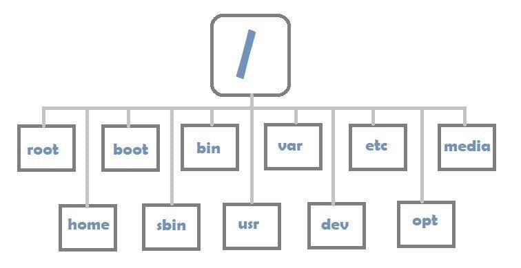
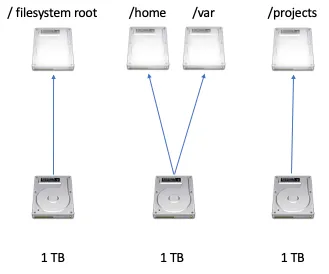
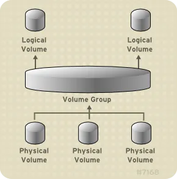

# Lời mở đầu
Linux là một hệ điều hành mã nguồn mở và được đóng góp bởi cộng đồng đông đảo. Hiện tại- thời điểm viết repo này 27-06-2025 có đến hơn 600 distro linux đã được phát hành và hơn 500 distro đang trong quá trình phát triển. Do đó, trong giới hạn của repo này, mình sẽ chỉ tập trung vào ubuntu, một bản phát hành phổ biến nhất theo khảo sát của geek-for-geek vào ngày 20/03/2025. [Link Bài viết](https://www.geeksforgeeks.org/linux-unix/8-most-popular-linux-distributions/)


[Lịch sử phát triển của Linux](https://blogd.net/linux/lich-su-he-dieu-hanh-linux/)
## File System
Kiến trúc thư mục file của ubuntu bao gồm: 



| Thư mục | Chức năng |
|---------|-----------|
| **`/root`** | Là thư mục home của user root. Nơi lưu trữ các thông tin và lịch sử của super user (user có quyền hạn lớn nhất trong Linux) |
| **`/bin`** | Là thư mục định nghĩa các câu lệnh sử dụng trong Linux<br>**ex:** Câu lệnh `pwd` sẽ được định nghĩa trong `/bin` để người dùng có thể sử dụng trên terminal |
| **`/boot`**  |  Là thư mục chứa nhân Linux để khởi động, GRUB, công cụ kiểm tra RAM, UEFI, ... |
|**`/dev`**| Chứa các device files, là các tệp đặc biệt đại diện cho phần cứng và thiết bị ảo trong hệ thống |
|**`/etc`**| Chứa các file cấu hình quan trọng của hệ thống như: cấu hình mạng, cấu hình các service, file khởi động, ..|
|**`/home`**|Thư mục lưu trữ dữ liệu của người dùng khác root|
|**`lib`**|Chứa các thư viện dùng chung cho các lệnh nằm trong /bin và /sbin. Thư mục này cũng chứa các module của kernel |
|**`mnt`**|Sử dụng để mount point với các thiết bị kết nối file bên ngoài, các file sysyem và lưu trữ bên ngoài. Ex: USB, ..|
|**`opt`**|Thư mục chứa các phần mềm cài thêm|
|**`/sbin`**|Chứa các lệnh quản trị hệ thống, chỉ dành cho root user |
|**`/srv`**|chứa dữ liệu của các dịch vụ (service data) mà hệ thống cung cấp. Chứa các dữ liệu cụ thể , thực tế mà user sử dụng khi truy cập vào một dịch vụ đối với máy chủ linux|
|**`/tmp`**|Thư mục chứa các file tạm thời|
|**`/usr`**|Thư mục chứa các ứng dụng mà người dùng sử dụng- thành phần tĩnh của ứng dụng. ex: file thực thi, các thư viện sử dụng chung , ...|
|**`/var`**|Chứa dữ  liệu thay đổi trong khi hệ thống hoạt động, bao gồm : log file, cache file, queue, ..|
|**`/proc`**|Là một filesystem ảo cung cấp các interface để truy cập kernel và process đang chạy, không tồn tại trong máy vật lý, được khởi tạo bởi ram |

# Traditional Storage Management vs Logical Volume Management

## Traditional Storage Management

<p align="center">
  
</p>
Đối với cách lưu trữ truyền thống, một ổ cứng sẽ đi cùng với một số phân vùng cố định, mỗi phân vùng sẽ có kích thước cố định ngay từ lúc tạo và không thể thay đổi dễ dàng. Điều này có nghĩa rằng khi bạn có một ổ cứng có dung lượng là 3n và chia thành 3 phân vùng có dung lượng là n, n, n thì các phân vùng này sẽ cố định dung lượng cho đến khi bạn thực hiện các thao tác như format lại ổ cứng.

### Cấu trúc phân cấp:
```
Physical Disk → Partition → File System → Mount Point
```

### Ưu điểm

Đối với cách thực hiện lưu trữ này, một số ưu điểm có thể kể đến:

- **Đơn giản, dễ hiểu** - Dễ dàng trong việc cô lập lỗi
- **Hiệu suất cao** - Truy cập trực tiếp vào hardware, không cần qua layer trung gian
- **Quản lý đơn giản**
- **Không cần metadata management**

### Nhược điểm

Đi cùng với những ưu điểm trên, Traditional Storage Management có những nhược điểm lớn có thể kể đến như:

- **Không linh hoạt về kích thước**
- **Lãng phí tài nguyên**
- **Khó trong việc backup và migrate dữ liệu** - Để có thể backup hoặc migrate dữ liệu, cần tắt dịch vụ và thực hiện backup → hệ thống downtime

Logical Volume Management được sinh ra để giải quyết vấn đề đó.

---

## Logical Volume Management (LVM)

**Tài liệu tham khảo:** [Red Hat - LVM vs Partitioning](https://www.redhat.com/en/blog/lvm-vs-partitioning)

> *"Logical volume management (LVM) is a form of storage virtualization that offers system administrators a more flexible approach to managing disk storage space than traditional partitioning"*


<p align="center">
  
</p>

LVM được cấu thành bằng cách xếp các lớp ảo hóa lên trên các thiết bị vật lý lưu trữ. Các lớp cơ bản có thể kể đến:

### Các thành phần của LVM

#### Physical Volume
- Các phân vùng vật lý được chia ra từ các ổ đĩa

#### Volume Group
- Là một nhóm bao gồm các Physical Volume trên 1 hoặc nhiều ổ đĩa khác nhau
- Kết hợp dung lượng lại với nhau thành Volume Group

#### Logical Volume
- Một Volume Group sẽ được chia nhỏ thành nhiều Logical Volume
- Nó được dùng để mount tới hệ thống file tập tin (File System)
- Được format với các định dạng ext2, ext3