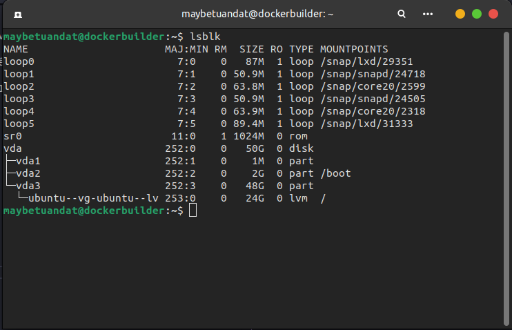
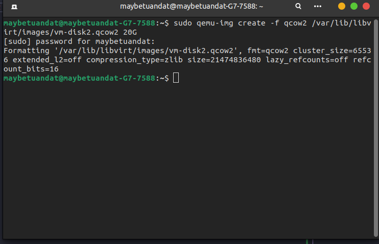
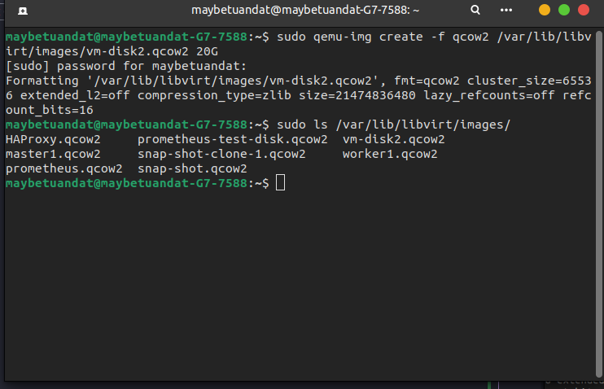
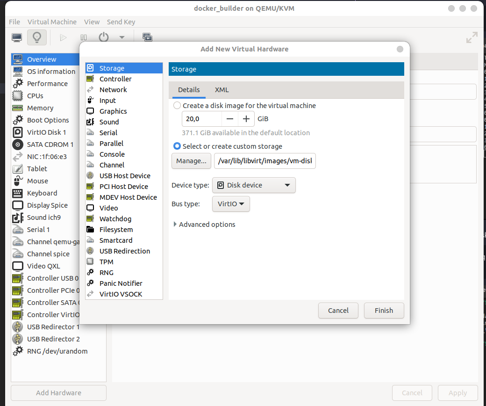
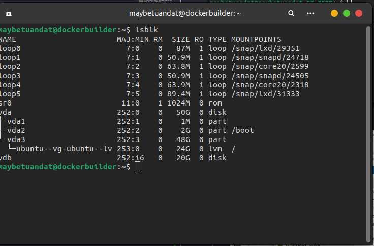
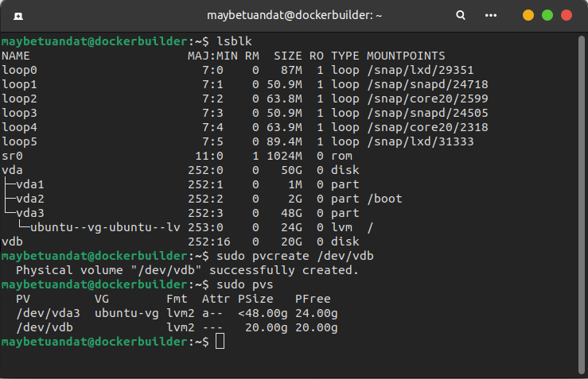
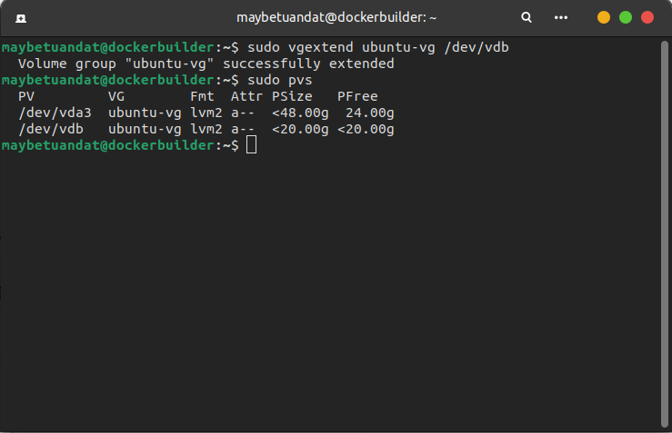
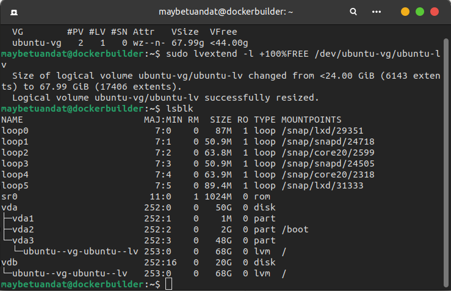
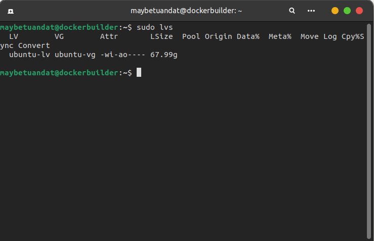
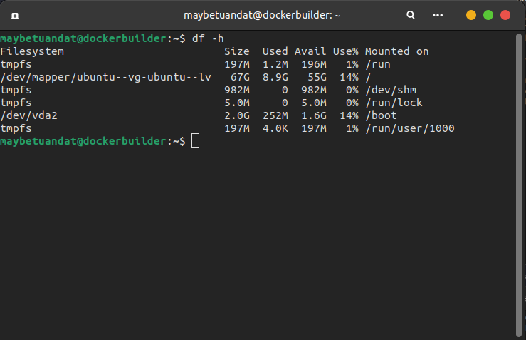

# Lời mở đầu
Linux là một hệ điều hành mã nguồn mở và được đóng góp bởi cộng đồng đông đảo. Hiện tại- thời điểm viết repo này 27-06-2025 có đến hơn 600 distro linux đã được phát hành và hơn 500 distro đang trong quá trình phát triển. Do đó, trong giới hạn của repo này, mình sẽ chỉ tập trung vào ubuntu, một bản phát hành phổ biến nhất theo khảo sát của geek-for-geek vào ngày 20/03/2025. [Link Bài viết](https://www.geeksforgeeks.org/linux-unix/8-most-popular-linux-distributions/)


[Lịch sử phát triển của Linux](https://blogd.net/linux/lich-su-he-dieu-hanh-linux/)
## File System
Kiến trúc thư mục file của ubuntu bao gồm: 


| Thư mục | Chức năng |
|---------|-----------|
| **`/root`** | Là thư mục home của user root. Nơi lưu trữ các thông tin và lịch sử của super user (user có quyền hạn lớn nhất trong Linux) |
| **`/bin`** | Là thư mục định nghĩa các câu lệnh sử dụng trong Linux<br>**ex:** Câu lệnh `pwd` sẽ được định nghĩa trong `/bin` để người dùng có thể sử dụng trên terminal |
| **`/boot`**  |  Là thư mục chứa nhân Linux để khởi động, GRUB, công cụ kiểm tra RAM, UEFI, ... |
|**`/dev`**| Chứa các device files, là các tệp đặc biệt đại diện cho phần cứng và thiết bị ảo trong hệ thống |
|**`/etc`**| Chứa các file cấu hình quan trọng của hệ thống như: cấu hình mạng, cấu hình các service, file khởi động, ..|
|**`/home`**|Thư mục lưu trữ dữ liệu của người dùng khác root|
|**`lib`**|Chứa các thư viện dùng chung cho các lệnh nằm trong /bin và /sbin. Thư mục này cũng chứa các module của kernel |
|**`mnt`**|Sử dụng để mount point với các thiết bị kết nối file bên ngoài, các file sysyem và lưu trữ bên ngoài. Ex: USB, ..|
|**`opt`**|Thư mục chứa các phần mềm cài thêm|
|**`/sbin`**|Chứa các lệnh quản trị hệ thống, chỉ dành cho root user |
|**`/srv`**|chứa dữ liệu của các dịch vụ (service data) mà hệ thống cung cấp. Chứa các dữ liệu cụ thể , thực tế mà user sử dụng khi truy cập vào một dịch vụ đối với máy chủ linux|
|**`/tmp`**|Thư mục chứa các file tạm thời|
|**`/usr`**|Thư mục chứa các ứng dụng mà người dùng sử dụng- thành phần tĩnh của ứng dụng. ex: file thực thi, các thư viện sử dụng chung , ...|
|**`/var`**|Chứa dữ  liệu thay đổi trong khi hệ thống hoạt động, bao gồm : log file, cache file, queue, ..|
|**`/proc`**|Là một filesystem ảo cung cấp các interface để truy cập kernel và process đang chạy, không tồn tại trong máy vật lý, được khởi tạo bởi ram |

# Traditional Storage Management vs Logical Volume Management

## Traditional Storage Management

<p align="center">
  
</p>
Đối với cách lưu trữ truyền thống, một ổ cứng sẽ đi cùng với một số phân vùng cố định, mỗi phân vùng sẽ có kích thước cố định ngay từ lúc tạo và không thể thay đổi dễ dàng. Điều này có nghĩa rằng khi bạn có một ổ cứng có dung lượng là 3n và chia thành 3 phân vùng có dung lượng là n, n, n thì các phân vùng này sẽ cố định dung lượng cho đến khi bạn thực hiện các thao tác như format lại ổ cứng.

### Cấu trúc phân cấp:
```
Physical Disk → Partition → File System → Mount Point
```

### Ưu điểm

Đối với cách thực hiện lưu trữ này, một số ưu điểm có thể kể đến:

- **Đơn giản, dễ hiểu** - Dễ dàng trong việc cô lập lỗi
- **Hiệu suất cao** - Truy cập trực tiếp vào hardware, không cần qua layer trung gian
- **Quản lý đơn giản**
- **Không cần metadata management**

### Nhược điểm

Đi cùng với những ưu điểm trên, Traditional Storage Management có những nhược điểm lớn có thể kể đến như:

- **Không linh hoạt về kích thước**
- **Lãng phí tài nguyên**
- **Khó trong việc backup và migrate dữ liệu** - Để có thể backup hoặc migrate dữ liệu, cần tắt dịch vụ và thực hiện backup → hệ thống downtime

Logical Volume Management được sinh ra để giải quyết vấn đề đó.

---

## Logical Volume Management (LVM)

**Tài liệu tham khảo:** [Red Hat - LVM vs Partitioning](https://www.redhat.com/en/blog/lvm-vs-partitioning)

> *"Logical volume management (LVM) is a form of storage virtualization that offers system administrators a more flexible approach to managing disk storage space than traditional partitioning"*


<p align="center">
  
</p>
LVM hiện có 2 phiên bản cho hệ điều hành Linux:

- Phiên bản nằm trong kernel 2.4 series
- Phiên bản mới nhất và lớn nhất của LVM cho Linux.  LVM 2 sử dụng trình điều khiển kernel mapper.


LVM được cấu thành bằng cách xếp các lớp ảo hóa lên trên các thiết bị vật lý lưu trữ. Các lớp cơ bản có thể kể đến:

### Các thành phần của LVM

#### Physical Volume
- Các phân vùng vật lý được chia ra từ các ổ đĩa

#### Volume Group
- Là một nhóm bao gồm các Physical Volume trên 1 hoặc nhiều ổ đĩa khác nhau
- Kết hợp dung lượng lại với nhau thành Volume Group

#### Logical Volume
- Một Volume Group sẽ được chia nhỏ thành nhiều Logical Volume
- Nó được dùng để mount tới hệ thống file tập tin (File System)
- Được format với các định dạng ext2, ext3
#### Extent
Extent là đơn vị nhỏ nhất mà LVM sử dụng để quản lý không gian lưu trữ. Thay vì làm việc với một khối toàn bộ ổ cứng như một khối lớn, LVM chia nhỏ storage thành những block nhỏ để dễ dàng sắp xếp và quản lý
Hai loại Extent:
- Physical Extent: Là đơn vị lưu trữ thực tế trên hardware
- Logical Extent: là cách LVM quản lý và hiển thị storage trong Logical Volume 
##### Cách hoạt động:
LVM tạo ra một bản đồ ánh xạ giữa Logical Extent và Physical Extent 
```
Logical Volume:  [LE1][LE2][LE3][LE4]
                  ↓    ↓    ↓    ↓
Physical Volume: [PE5][PE2][PE8][PE1]
```
Một số ưu điểm của việc sử dụng Extent:
- Linh hoạt: LVM có thể di chuyển dữ liệu từ PE này sang PE khác mà không ảnh hưởng đến LE, cho phép thay thế ổ cứng cũ mà không cần tắt máy.
- Mở rộng dễ dàng: Chỉ cần thêm PE, không ảnh hưởng đến việc downtime của hệ thống
## Cách sử dụng và tạo LVM

## Chuẩn bị

Trong khuôn khổ bài viết này mình sẽ sử dụng KVM với virt-manager. Nếu các bạn chưa có kiến thức về KVM và virt-manager có thể xem lại bài viết này của mình: [Link bài viết]()

**Yêu cầu:**
- Máy ảo có dung lượng cố định là 10GB

## Các bước thực hiện

### 1. Tạo máy ảo và thực hiện cài LVM

**Bước 1:** Thực hiện cài lvm bằng câu lệnh:

```bash
sudo apt install lvm2
```

**List available disks:**

```bash
lsblk
```



**Bước 2:** Thực hiện tạo một file disk image mới với qemu

```bash
sudo qemu-img create -f qcow2 /var/lib/libvirt/images/vm-disk2.qcow2 20G
```




**Bước 3:** Thực hiện thêm disk vào máy ảo



Không cần thực hiện các thao tác restart hay shutdown. Ổ đĩa tự động nhận đối với LVM



**Bước 4:** Thực hiện tạo physical volume từ disk mới được thêm vào

```bash
sudo pvcreate /dev/vdb
sudo pvs
```



**Bước 5:** Thực hiện add vào volume group

```bash
sudo vgextend ubuntu-vg /dev/vdb
```



**Bước 6:** Thực hiện thêm toàn bộ không gian lưu trữ vừa thêm vào Logical Volume

```bash
sudo lvextend -l +100%FREE /dev/ubuntu-vg/ubuntu-lv
```



Dung lượng logical volume sau khi được resize:



**Bước 7:** Thực hiện mở rộng file system

```bash
sudo resize2fs /dev/ubuntu-vg/ubuntu-lv
```

**Kết quả:**



## Kết luận

LVM giúp quá trình thêm và mở rộng dung lượng đối với một máy ảo một cách đơn giản hơn, giải quyết vấn đề lưu trữ cũng như tạo máy ảo một cách truyền thống. Nó sẽ đơn giản việc backup dữ liệu, migrate mà không khiến hệ thống downtime.