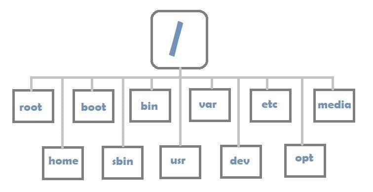

# Lời mở đầu
Linux là một hệ điều hành mã nguồn mở và được đóng góp bởi cộng đồng đông đảo. Hiện tại- thời điểm viết repo này 27-06-2025 có đến hơn 600 distro linux đã được phát hành và hơn 500 distro đang trong quá trình phát triển. Do đó, trong giới hạn của repo này, mình sẽ chỉ tập trung vào ubuntu, một bản phát hành phổ biến nhất theo khảo sát của geek-for-geek vào ngày 20/03/2025. [Link Bài viết](https://www.geeksforgeeks.org/linux-unix/8-most-popular-linux-distributions/)
## File System
Kiến trúc thư mục file của ubuntu bao gồm: 

| Thư mục | Chức năng |
|---------|-----------|
| **`/root`** | Là thư mục home của user root. Nơi lưu trữ các thông tin và lịch sử của super user (user có quyền hạn lớn nhất trong Linux) |
| **`/bin`** | Là thư mục định nghĩa các câu lệnh sử dụng trong Linux **ex:** Câu lệnh `pwd` sẽ được định nghĩa trong `/bin` để người dùng có thể sử dụng trên terminal |

